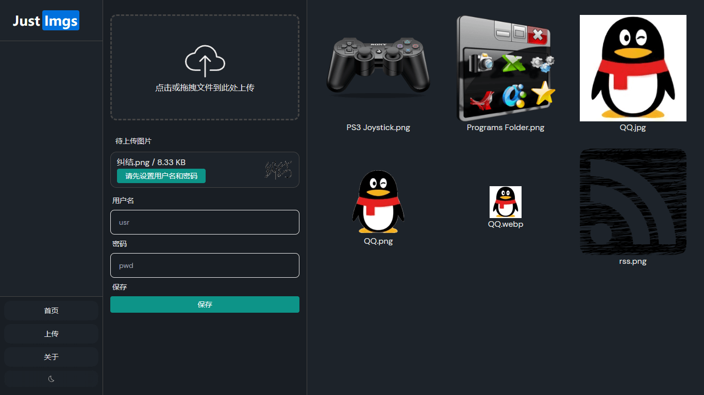
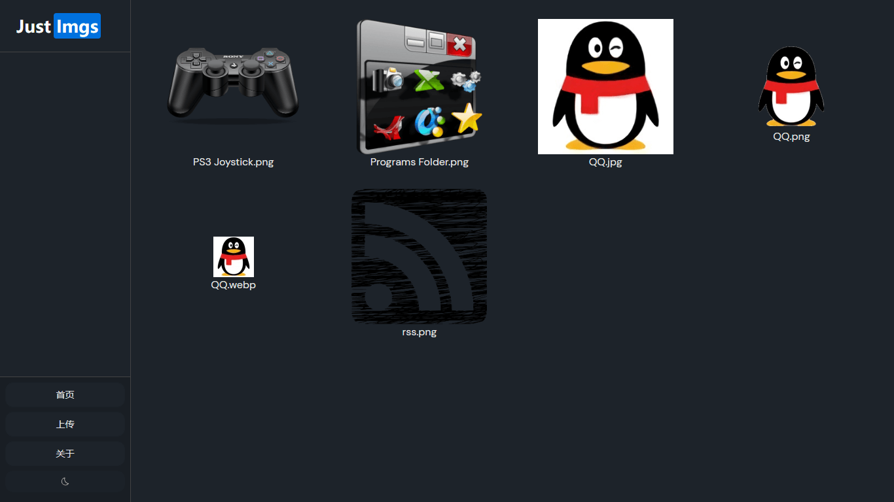

# Just-Imgs

图床管理前端，Vite + Vue3 + TS，对接 Cloudflare Worker + R2 使用；

## 安装 / 调试 / 构建

- 执行 `install` 操作会自动生成 `.env.dev.local` 和 `.env.local`，分别用于本地调试和打包构建；
    - 修改其中的 `VITE_CF_WORKER_URL` 为正式或测试环境的 Cloudflare Worker 地址；
    - 参考：[环境变量和模式 | Vite 官方中文文档](https://cn.vitejs.dev/guide/env-and-mode.html "环境变量和模式 | Vite 官方中文文档")
- 下载 Worker 项目，设置相应的变量文件用于上传图片时的验证鉴权；
    - 调试运行时端口号会随机变更，需要修改至 vite 配置内；
- 用户名密码会保存在浏览器 localStorage 中；
- \--------------
- Worker 可以直接执行 `npm run deploy` 进行部署，前端这边可以打包后传 GitHub Pages 或者 Cloudflare Pages；
    - 部署至 Cloudflare Pages 时需要设置 `VITE_CF_WORKER_URL=http://Worker 服务地址/` 和 `NODE_VERSION=18.16.1` 两个环境变量；
- 吐槽：见过几个项目带 `netlify.toml` 了，然而就没感觉没啥存在感；

## 截图

<!-- ##################################### -->
